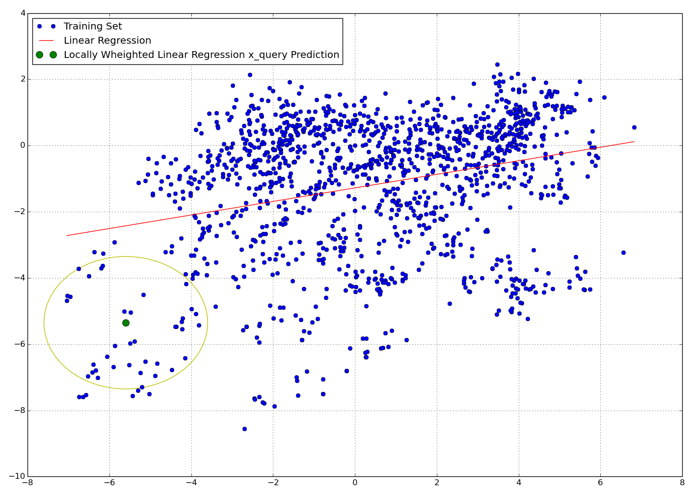

# Locally Weighted Linear Regression in NoSQL world: MapReduce, Spark, Hive and Spark SQL implementations over Hadoop HDFS.

In this document we provide a brief discussion on the LWR algorithm and somewhat detailed description on how to run our code using each tool on the provided VirtualBox VM (code is available on [project's github](https://github.com/alexsalo/nosql-locally-weighted-regression)).

Document structure:

1. [Locally Weighted Linear Regression](#lwr)
    - [Algorithm Discussion](#lwr-discussion)
    - [Performance Analysis and Parallelization Options](#lwr-performance)
2. [Hadoop Ecosystem Overview](#hadoop-overview)
3. [Setting Up OS Env](#os-setup)
4. [NoSQL implementations:](#nosql)
    - [MapReduce](#nosql-mapreduce)
    - [Spark](#nosql-spark)
    - [Hive](#nosql-hive)
    - [SparkSQL](#nosql-sparksql)

## <a id="lwr"></a> 1. Locally Weighted Linear Regression
Often, when working with real data, we realize that our data doesn't really lie on the straight line - in other words linear regression fails to capture a lot of variation. When that happens we can use a higher degree polynomial of our features to fit data perfectly. The problem with such parametric approach is two-fold: first, we need to manually choose the "right" degree of polynomials which leads to either underfitting or overfitting; second, we don't take advantage of the new data that will flow in - once the model is set it is not going to change.

To address these issues we want to implement Locally Weighted [Linear] Regression (LWR), which, assuming sufficient size of the training set, makes the choice of features much less critical. Additionally, LWR is a lazy learning approach and allows us learn on the newly obtained data. Given the goal of Big Data analytics, we definitely want to make use of all the data, yet we are concerned with the computational efficiency. Thus we would like to use NoSQL tools to implement LWR. Now let us briefly discuss the math behind the LWR algorithm, evaluate its time complexity  and find possibilities for optimization via parallelization.

### <a id="lwr-discussion"></a> Algorithm Discussion
To understand Locally Weighted linear Regression (LWR) let us consider a simple linear regression (LR) first. As an input we have N-dimensional dataset X with M examples (each example has N features) and 1-dimensional vector Y with targets. The goal of LR is to fit the line that would map X -> Y at the minimized OLS sum. Such line would allows us to predict y-value for any x-input.
```shell
m  | X (features)  | Y (targets)  
--------------------------------
1: |1 x0 x1 x2 ... xn| y
2: |1 x0 x1 x2 ... xn| y
.: |1 ...      ...   | y
M: |1 x0 x1 x2 ... xn| y
```
Note that we appended X to a columns of ones - resulting matrix is called a *design matrix* - it allows us to find the intercept of the line. To construct that line (or, more generally, a hyperplane in N-dimensional space) we find the best hypothesis **theta** (which is a vector [size N] of coefficients for each dimension of X) by solving the following normal equation:
<div style="text-align:center">X'X&theta;=X'Y</div>

The closed form solution then:
<center>&theta;=inv(X'X)X'Y</center>

This solution gives the intercept and slopes (hypothesis &theta;) for the line in each X's dimension. The LWR goes a step further and locally adjusts the line according to the proximity to other data points - the closer the point the more weight it has.

That is a good time to introduce one simple yet not very intuitive feature of LWR. In LR, all we need to do in order to construct a line (hyperplane) is to solve *one normal equation*, which gives the hypothesis &theta;, using which *we can predict y-value for any input x-value* by reusing the hypothesis and simply calculating the product x'&theta; (here and later capital X or Y represents a set of data examples while small x or y represents one particular example).

In the LWR, since our predictions are no longer linear, but adjusted by the neighboring points, *for each x-point we want to predict (we would call it query point), we need to calculate its own hypothesis &theta;*. For each such query point we consider all other points available, but their influence is weighted by the distance to our query point. That is a LWR in a nutshell. Let us now see how it translates into linear algebra.

In fact, all we need to change for LWR is to add a weight matrix W (diagonal matrix of size m x m), and solve the analogous normal equation as:
<center>&theta;=inv(X'WX)X'WY</center>

Finally, note that we use a Gaussian Kernel as our distance function. We use bandwidth parameter *C=0.5* throughout this project. The choice of the bandwidth could be optimized and found automatically, but that does not change anything in our area of interest.

### <a id="lwr-performance"></a> Performance Analysis and Parallelization Options
Just how fast LWR works? Should we even care to parallelize? The answer is yes - we want to calculate the distance to every other data point after all. In particular, we assume that there are ever growing loads of examples to learn on available (hundreds of thousands or more), while the number of features in each example is relatively small (on the order of tens or hundreds). In other word we explicitly assume **M >> N**. Also we have *P* cores (or commodity computers in the cluster) available.

One obvious way to parallelize LWR is when we want to calculate the prediction for several query points. In that case we simply split the set of Q query points between the P cored and we are done ~Q/P times faster. Implementing this trivial solution is rather straightforward so we would not consider it. Instead we would be concerned in how can we *parallelize the computations for a single query point*.

Recall that in order to find a hypothesis &theta; for a single query point over the set of training examples we need to solve the following normal equation:
<center>A&theta;=B</center>
Where:

```shell
A = X'WX has dimensions: X'(n x m) * W(m x m) * X(m x n) => A (n x n)
B = X'WY has dimensions: X'(n x m) * W(m x m) * Y(m x 1) => B (n x 1)
theta = inv(A)*B has dimensions: A (n x n) * b (n x 1) => theta (n x 1)
```
Note that we can perform exactly the same operations over an individual training examples:
```shell
# given ith example x = X[i]
a = x'wx has dimensions: x'(n x 1) * w(1 x 1) * x(1 x n) => a (n x n)
b = x'wy has dimensions: x'(n x 1) * w(1 x 1) * y(1 x 1) => b (n x 1)
```
And they produce the matricies a and b of exactly the same size as A and B. Thus we notice the additivity property in the LWR calculation, and that is a good sign of the parallelization eligibility.

In fact, all we need to do is to split all the training examples into the P equal parts and feed them to P cores to deal with. Each core will compute partial sums of matricies A and B. Then we simply sum those intermediate matricies produced by each core into resulting A and B, and then compute the hypothesis as &theta;=inv(A)\*B

The time complexity of a single core LWR is given by O(mn<sup>2</sup>) to compute x'x, m times, plus O(n<sup>3</sup>) to invert the matrix, totalling to O(mn<sup>2</sup> + n<sup>3</sup>).

On our LWR (no parallelization of the matrix inverse), P cores gives us total of O(mn<sup>2</sup>/P + n<sup>3</sup>), plus some communication cost. Given our assumption m>>n we can drop the n term and estimate the time complexity as O(m/P), and expect that, in theory, LWR should perform linearly faster with the increase in the number of cores.


## <a id="hadoop-overview"></a> 3. Hadoop Ecosystem Overview
### Hadoop Ecosystem Overview
How do we set about to implement LWR in NoSQL world? We want something robust, open source and easy to work with. Luckily, there is just such a thing:
> The Apache Hadoop software library is a framework that allows for the distributed processing of large data sets across clusters of computers using simple programming models.

Hadoop consists of two main things: a *Distributed File System (HDFS)* and computational framework *MapReduce*. HDFS provides us with fault tolerant distributed file storage system that provides high-throughput access to application data. MapReduce allows easy parallel processing of large data sets. There are also a *Hadoop Common* utilities used by other tools within Hadoop Ecosystem, and YARN - framework for job scheduling and cluster resource management, which is not going to play a critical role in our implementations.

Thus our initial attempt of implementing LWR would be in native MapReduce over HDFS. To use MR one can either implement abstract map and reduce classes in Java or take advantage of Hadoop Streaming API, which is a utility allowing to *run any executable as Mapper/Reducer*. Essentially, Hadoop Streaming facilitates passing data between our Map and Reduce phases via STDIN and STDOUT. Thus, since we want to use Python, to read &lt;key, value> pair we simply read from sys.stdin; to emit &lt;key, value> pair we write (print) to sys.stdout. Hadoop Streaming takes care of the rest.

On the next step we will try Apache Spark, which works on top of HDFS. Moreover, Spark can run on top of YARN and/or MapReduce. Spark revolves around the concept of a resilient distributed dataset (RDD), which is a fault-tolerant collection of elements that can be operated on in parallel. Once created, the RDD can be operated on in parallel. Besides advantageous RDDs, Spark allows developer to write code in Java, Scala or Python.

Another approach is to leverage distributed capabilities of HDFS and reuse MapReduce. That's where HBase and Hive come into play.

The main problem with HDFS, that as any FS, it *lacks random read and write access*. That's where HBase comes into play to provide read/write capabilities. HBase is a distributed, scalable, big data store build on blueprints of Google's BigTable. In other words, HBase is a database (not as FS). HBase stores data as key/value pairs, which makes it look like a hashmap, or an index table: if you know the key - you get answer fast.

Hive approaches a problem from the different angle. It provides data warehousing facilities on top of an existing Hadoop cluster. We can create tables in Hive and store data there. Hive also provide HQL, similar to SQL in syntax, to query our data in an arbitrary style.

These are the descriptions from the official web sites:

> - HBase™: A scalable, distributed database that supports structured data storage for large tables.
> - Hive™: A data warehouse infrastructure that provides data summarization and ad-hoc querying.

We are interested exactly in this *ad-hoc querying*. For example, we want to run locally weighted regression on some subset of the columns, maybe even restricting rows with some *WHERE* clause. Thus we probably want to choose Hive. To rephrase our choice I'd cite a StackOverflow answer:

> HBase is like a Map. If you know the key, you can instantly get the value. But if you want to know how many integer keys in Hbase are between 1000000 and 2000000 that is not suitable for Hbase alone. If you have data to be aggregated, rolled up, analyzed across rows then consider Hive.

Thus we select Hive as our database-like approach to tackle LWR.

Finally, we can run SparkSQL on top of everything: over HDFS files or Hive tables, over Spark RDDs or/and using MapRecude jobs. To quote SparkSQL web site:
> Seamlessly mix SQL queries with Spark programs. Spark SQL lets you query structured data inside Spark programs, using either SQL or a familiar DataFrame API. Usable in Java, Scala, Python and R.

> DataFrames and SQL provide a common way to access a variety of data sources, including Hive, Avro, Parquet, ORC, JSON, and JDBC. You can even join data across these sources.

> Spark SQL reuses the Hive frontend and metastore, giving you full compatibility with existing Hive data, queries, and UDFs. Simply install it alongside Hive.

In other words, with SparkSQL we can combine all the benefits of either HDFS, MapRecude, HIVE and Spark under unified workspace and using desirable Python.


## <a id="os-setup"></a> 2. Setting Up OS Env
You can skip this section if you are simply executing files on provided VM (come back if you see any suspicious exceptions). Here we highlight the basic OS environment setup that will ease our work with NoSQL tools. All the tools, in the latest stable version as of 25 April 2016, were downloaded from official Apache servers and unpacked into */nosql/<toolname>* folder. Along with that, */nosql/* folder contains an *input/* folder with our input data. Below is a short description of the project folder structure:
```shell
$ sudo su    # password: bigdata
$ cd /nosql
$ tree --filelimit 8  # show folder structure
├── hadoop
│   ├── aux                             # Sources and auxiliary scripts that were left off
│   ├── hadoop-2.7.2                    # Hadoop Home
│   ├── lwr_mapreduce_find_theta.py     # Script to find hypothesis using MR output files
│   ├── lwr_mapreduce_mapper.py         # MapReduce mapper
│   ├── lwr_mapreduce_reducer.py        # MapReduce reducer
│   ├── lwr_plot_x_query.py             # Demo script to visualize LWR prediction in 2D
│   ├── np_matrix_helpers.py            # Helper functions to communicate Numpy matricies
│   └── README.md         
├── hive   
│   ├── apache-hive-2.0.0-bin           # Hive Home
│   ├── aux   
│   ├── lwr_hive_find_theta.py   
│   ├── lwr_hive_mapper.py   
│   └── README.md   
├── input                               # Input data (txt) files, separator=','
│   ├── x_data.txt x_data2.txt ...   
├── lwr_demo.png                        # Demo of the LWR prediction
├── README.md                           # This document
├── spark                            
│   ├── aux
│   ├── lwr_spark.py
│   ├── README.md
│   └── spark-1.6.1-bin-without-hadoop  # Spark Home
└── sparksql
    ├── csv-to-json.py
    ├── lwr_sparksql.py
    └── README.md
```
**Important note**: if you change something, make sure all your *python executable files know the path to python interpreter* and *have correct privileges*:
```shell
$ cat <python_script>.py
# #!/usr/bin/env python
# ...
$ chmod +x python_script.py
```

To be able to *run all the tools from anywhere* we need to update system *PATH* variable. To make update permanent, we put append into */root/.bash_rc* the */root/.bash_nosql_exports* file with the following content:
```shell
export JAVA_HOME=/usr/lib/jvm/java-7-openjdk-amd64
export HADOOP_HOME=/nosql/hadoop/hadoop-2.7.2
export SPARK_HOME=/nosql/spark/spark-1.6.1-bin-without-hadoop
export HIVE_HOME=/nosql/hive/apache-hive-2.0.0-bin

# Append PATH
export PATH=$HIVE_HOME/bin:$HADOOP_HOME/bin:$SPARK_HOME/bin:$PATH
```

Save that and open a new terminal to apply changes. Check you PATH:
```shell
$ echo $PATH
/nosql/hive/apache-hive-2.0.0-bin/bin:/nosql/hadoop/hadoop-2.7.2/bin:/nosql/spark/spark-1.6.1-bin-without-hadoop/bin:/usr/local/sbin:/usr/local/bin:/usr/sbin:/usr/bin:/sbin:/bin:/usr/games:
```

Despite these are permanent settings, when we run the any of the tools, they look into *<tool>-env.sh* conf file to apply any settings. You want to make sure you have the following:  
```shell
$ vi ${HADOOP_HOME}/etc/hadoop/hadoop-env.sh
export JAVA_HOME=/usr/lib/jvm/java-7-openjdk-amd64
export PATH=${JAVA_HOME}/bin:${PATH}
# make sure you append tools.jar to an existing HADOOP_CLASSPATH
export HADOOP_CLASSPATH=${JAVA_HOME}/lib/tools.jar:${HADOOP_CLASSPATH}

vi ${SPARK_HOME}/conf/spark-env.sh
# We reuse our Hadoop installation in Spark - specify the path
export SPARK_DIST_CLASSPATH=$(/nosql/hadoop/hadoop-2.7.2/bin/hadoop classpath)
export JAVA_HOME=/usr/lib/jvm/java-7-openjdk-amd64
export SPARK_HOME=/nosql/spark/spark-1.6.1-bin-without-hadoop

vi ${HIVE_HOME}/conf/spark-env.sh
export HADOOP_HOME=/nosql/hadoop/hadoop-2.7.2  # Hive uses Hadoop common libraries
export HIVE_HOME=/nosql/hive/apache-hive-2.0.0-bin
export PATH=$HIVE_HOME/bin:$PATH
```

Note that SparkSQL, despite being a separate tool, comes within the basic Spark distribution and thus everything is already set (almost - we would need to compile it with the specific jars to support, say, the interaction with Hive, but we won't do that).


## <a id="nosql"></a> 4. NoSQL implementations:
Time for the experiments! Please note that to make examples self contained we provide redundant code for each tool (along with simplified code listings in the descriptions). Also, recall that our goal is to calculate prediction (by y=&theta;x) of **single x_query point**. We embedded this x_query point in each executable script to simplify the execution, but, obviously, this could be interfaced out. Additionally, we will provide a visual demo when using our first tool MapReduce, but for the following tools we will be satisfied when we get the same correct hypothesis &theta;. Finally, note that you **have to** go through MapRecude part first in order to start HDFS service, which all other tools rely on. OK, Let's get started!

### <a id="nosql-mapreduce"></a> MapReduce via Streaming API
Hadoop Streaming API allows to run any executable files as mappers and reducers in MapReduce framework. We are using Python to implement locally weighted linear regression algorithm - we provide a simplified code listing for illustrative purposes below. There are three ways to execute python scripts:

1. [Linux pipes to imitate MapReduce for development/testing purposes](#linux-pipes)
2. [Hadoop single node without HDFS to make sure everything works](#hadoop-single)
3. [Hadoop pseudo-distributed mode, which emulate the full working environment with HDFS running (but without YARN)](#pseudo-distributed)

Also you can jump straight to [Visual Demo of LWR Prediction](#demo)

##### MapReduce Streaming API Implementation
Let us briefly review our implementation (full code available at [project's github](https://github.com/alexsalo/nosql-locally-weighted-regression)). Mapper:
```python
def gauss_kernel(x_to, c):
    d = x_query - x_to
    d_sq = d * d.T
    return np.exp(d_sq / (-2.0 * c**2))


# read file line by line; calculate and emit normal equation matricies A and B
for line in sys.stdin:
    # parse values assuming x1 x2 x3 ... y
    values = line.strip().split(',')
    x = np.matrix([1.0] + [float(val) for val in values[:-1]])
    y = np.matrix([float(values[-1])])

    weight = gauss_kernel(x, c=C)

    # accumulate A and B
    a += np.multiply(x.T * x, weight)
    b += np.multiply(x.T * y, weight)

# emit partial resulting martricies A and B into STDOUT
print '%s\t%s' % ('a', mat2str(a))
print '%s\t%s' % ('b', mat2str(b))
```

Reducer:
```python
# sum A and b matricies received from mapper
for line in sys.stdin:
    # parse <key, value> from STDIN
    mat_type, mat_str = line.strip().split('\t', 1)
    mat = str2mat(mat_str)

    if mat_type == 'a':
       a += mat
    if mat_type == 'b':
       b += mat

# emit full matricies A and B to STDOUT (saved into HDFS)
print '%s' % (mat2str(a))
print '%s' % (mat2str(b))
```

Time to execute! All the following commands are issued from the */nosql/hadoop/* on the virtual machine under root privileges:
```shell
$ sudo su            # password: bigdata
$ cd /nosql/hadoop/  # which has hadoop installation hadoop-2.7.2/
```

#### <a id="linux-pipes"></a> 1. Linux Pipes for Development/Testing
While each step could be separated, ultimately we want to chain *input -> mapper -> reducer -> find_theta:*

First, let's run mapper and reducer on the input files:
```shell
$ cat /nosql/input/* | /nosql/hadoop/lwr_mapreduce_mapper.py | /nosql/hadoop/lwr_mapreduce_reducer.py
```
Which produces the following output:
```shell
0.04429884,-0.25175942,0.40566047,-0.01703711;-0.25175942,1.43521279,-2.30624365,0.09647099;0.40566047,-2.30624365,3.71557318,-0.15618137;-0.01703711,0.09647099,-0.15618137,0.00681046
-0.26564261;1.51042747;-2.43520908;0.10292634
```
These are two lines, each containing numpy arrays encoded for IO via *np_matrix_helpers.py*. First line is a matrix **A (n x n)**; second line is a matrix **B (n x 1)**.

With Linux pipes we can directly feed these matricies to *find_theta.py* script to make a hypothesis:
```shell
$ cat /nosql/input/* | /nosql/hadoop/lwr_mapreduce_mapper.py |
/nosql/hadoop/lwr_mapreduce_reducer.py | /nosql/hadoop/lwr_mapreduce_find_theta.py
```
Which produces the hypothesis that we were looking for:
```shell
[[ 26.89559418]
 [ -0.58025811]
 [ -3.96902175]
 [ -0.40520663]]
```

#### <a id="hadoop-single"></a> 2. Hadoop single node without HDFS
*--You can skip this part if you are not developing new functionality--*

First, make sure single node mode is activated. Edit the following two files and leave empty configuration tags:
```shell
$ vi hadoop-2.7.2/etc/hadoop/core-site.xml hdfs-site.xml
# <configuration>
# </configuration>
```

Then let's remove an output folder from the previous run (otherwise you'll see error):
```shell
$ rm -r mapreduce_output
```

Now we can run MapReduce. Don't forget to include streaming API jar:
```shell
$ hadoop jar hadoop-2.7.2/share/hadoop/tools/lib/hadoop-streaming-2.7.2.jar \
-mapper lwr_mapreduce_mapper.py \
-reducer lwr_mapreduce_reducer.py \
-input /nosql/input/* \
-output output
```
That produces two lines with matricies **A** and **B**, just as our Linux pipes example did (we will take a closer look at MapReduce log info in the next part). To make a hypothesis do:

```shell
cat output/* | /nosql/hadoop/lwr_mapreduce_find_theta.py
```
Which again produces the hypothesis:
```shell
[[ 26.89559418]
 [ -0.58025811]
 [ -3.96902175]
 [ -0.40520663]]
```

#### <a id="pseudo-distributed"></a> 3. Hadoop in Pseudo-Distributed Mode with HDFS Running
Now that the trials of dev and tests are finished, let's run a full deal. First, make sure pseudo-distributed mode is activated. Edit the following two files and add the following configuration tags:
```shell
$ vi hadoop-2.7.2/etc/hadoop/core-site.xml
# <configuration>
#     <property>
#         <name>fs.defaultFS</name>
#         <value>hdfs://localhost:9000</value>
#     </property>
# </configuration>

$ vi hadoop-2.7.2/etc/hadoop/hdfs-site.xml
# <configuration>
#     <property>
#         <name>dfs.replication</name>
#         <value>1</value>
#     </property>
# </configuration>
```

Then format HDFS:
```shell
$ hdfs namenode -format
```

Start NameNode and DataNode daemons:
```shell
$ hadoop-2.7.2/sbin/start-dfs.sh
```

Check that HDFS has the following directories by browsing http://localhost:50070/. If not present - create them:
```shell
$ hdfs dfs -mkdir /user
$ hdfs dfs -mkdir /user/root  # should be the same username as in your vm
$ hdfs dfs -mkdir /user/root/input
```

Put input file(s) from local path into HDFS path. Note that (given our test data size is relatively small) in order to make more mappers we want to make more data splits, which is naturally achieved by dividing data file into several files. In our case we simply copy the same data file several times.
```shell
$ hdfs dfs -put /nosql/input/* /user/root/input/
```

Now that the preparation is done we can actually run our executable python scripts as a MapReduce jobs (make sure you removed the output folder if you run second time):
```shell
$ hdfs dfs -rm /user/root/mapreduce_output
$ hadoop jar hadoop-2.7.2/share/hadoop/tools/lib/hadoop-streaming-2.7.2.jar \
-mapper lwr_mapreduce_mapper.py \
-reducer lwr_mapreduce_reducer.py \
-input /user/root/input/* \
-output /user/root/mapreduce_output
```

Note the following in the MapReduce log info:
```shell
...
16/04/26 11:14:25 INFO mapred.FileInputFormat: Total input paths to process : 4
16/04/26 11:14:25 INFO mapreduce.JobSubmitter: number of splits:4
...
Map-Reduce Framework
		Map input records=5488
		Map output records=8
		Map output bytes=940
    ...
		Reduce input groups=2
    ...
		Reduce input records=8
		Reduce output records=2
```
MapReduce framework decide number of splits over the input data based on the split_size, determined as *split_size = max(minimumSize, min(maximumSize, blockSize))*. Additionally, it naturally "splits" the separate files. We took advantage of the latter to force 4 splits, which produced 8 map output records (4 of each partially summed matricies A and B). Then framework shuffled and sorted map output records and reduced by key into 2 output records (fully summed A and B). That is the output that we save on HDFS /mapreduce_output.

Now we can cat resulted matricies in HDFS and calculate thetas what we were looking for:
```shell
$ hdfs dfs -cat /user/root/mapreduce_output/* | /nosql/hadoop/lwr_mapreduce_find_theta.py
```

Which again produces the correct hypothesis &theta;:
```shell
[[ 26.89559418]
 [ -0.58025811]
 [ -3.96902175]
 [ -0.40520663]]
```

####  <a id="demo"></a> Visual Demo of LWR Prediction
This tutorial comes with a demo. Run the following script to visually confirm LWR prediction, which takes into account the locality of the x_query (unlike simple linear regression):
```shell
$ hdfs dfs -cat /user/root/mapreduce_output/* | /nosql/hadoop/lwr_plot_x_query.py
```

This should produce a picture like that:



To finish up - shut down the daemons:
```shell
$ hadoop-2.7.2/sbin/stop-dfs.sh
```

##### A Note on Scalability
Provided algorithm scales efficiently as the data volume growth. With N nodes in the system, the HDFS distributes the large file over all these N nodes. When you start a job, there will be N mappers by default (in our case of small data split into four files there are four mappers by default). Hadoop makes sure the mapper on a machine will process the part of the data that is stored on this node, which is called Rack awareness.

##### A Note on Matrix IO
We implemented custom serializer/parser to communicate matricies between mapper and reducer. As it turned out, the float precision is of crucial importance for that matter. For a production environment one may want to increase precision of the floating point (currently 8 digits after the point) in *np_matric_helpers*.

### <a id="nosql-spark"></a> Spark
While MapReduce provides a fine grain way to write our own mappers and reducers for the parallel run, the developer has to make a lot of strategic decisions on how exactly to separate logic load between mapper and reducer executable and how to communicate between them. Additionally, the output of the reducers is a set of <key, value> pairs that have to be evaluated in the separate program. It is neither good or bad, but definitely requires more effort and skill than when the developer uses our next tool - Spark.

Spark revolves around the concept of a resilient distributed dataset (RDD), which is a fault-tolerant collection of elements that can be operated on in parallel. For this tutorial we need HDFS to be already set and running; HDFS should contain /user/root/input folder with data files. Please refer to the README in /nosql/hadoop folder on how to set it up.

All the following commands are issued from the *spark* working directory on the virtual machine under root privileges:
```shell
$ sudo su           # password: bigdata
$ cd /nosql/spark/  # which has spark installation spark-1.6.1-bin-without-hadoop/
```

Then start Spark cluster (then check http://localhost:8080/):
```shell
$ /nosql/spark/spark-1.6.1-bin-without-hadoop/sbin/start-all.sh
```

With Spark, we can access files in both local FS and the HDFS:
```shell
$ pyspark
# Open Local File in FS
localFile = sc.textFile("file:///nosql/input/x_data.txt")
localFile.count()
# 1372

# Open file in HDFS:
hdfsFile = sc.textFile("/user/root/input/*.txt")
hdfsFile.count()
# 5488
```

The major benefit of Spark over plain MapReduce is that it provides an consolidated API in Java, Scala or Python. From the [Spark Programming Guide](http://spark.apache.org/docs/latest/programming-guide.html)
> For example, map is a transformation that passes each dataset element through a function and returns a new RDD representing the results. On the other hand, reduce is an action that aggregates all the elements of the RDD using some function and returns the final result to the driver program.

That means we still use the same idea of mapper and reducer here. However the benefit is, to quote the official site again:
> All transformations in Spark are lazy, in that they do not compute their results right away. Instead, they just remember the transformations applied to some base dataset (e.g. a file). The transformations are only computed when an action requires a result to be returned to the driver program. This design enables Spark to run more efficiently – for example, we can realize that *a dataset created through map will be used in a reduce and return only the result of the reduce to the driver, rather than the larger mapped dataset* (Italics are mine).

So what we have to change in our LWR scripts? Not much. Basically, we simply make a functions out of the mapper and reducer and pass into Spark to run. Below is a simplified implementation (full code available at [project's github](https://github.com/alexsalo/nosql-locally-weighted-regression)):

```python
sc = SparkContext('local', 'spark app')
data = sc.textFile('/user/root/input/x_data*.txt')

def mapAB(line):
    def gauss_kernel(x_to, c):...

    # parse values assuming x1 x2 x3 ... y
    values = line.strip().split(',')
    x = np.matrix([1.0] + [float(val) for val in values[:-1]])
    y = np.matrix([float(values[-1])])

    weight = gauss_kernel(x, c=C)
    return [('a', np.multiply(x.T * x, weight)),
            ('b', np.multiply(x.T * y, weight))]

# Run LWR
ab = data.flatMap(mapAb)  # transformation, maps input into list of tuples (K, V)
         .reduceByKey(lambda total, mat: total + mat)   # transformation, sorts and reduces the list
         .collect()  # action, forces execution of all *lazy* transformations

a = ab[0][1]  # first element of the list, second element in the tuple
b = ab[1][1]  # second element of the list, second element in the tuple

theta = a.I * b  # we found our LWR hypothesis!

# Save result into HDFS
sc.parallelize(theta).saveAsTextFile('/user/root/spark_output')
```

Note that we didn't even have to write a custom reducer since all it does is it sums the Numpy matricies - easily done with simple lambda expression. To execute the full script:
```shell
spark-submit --master local[4] /nosql/spark/lwr_spark.py
```

Let us check what we've got and compare with the MapReduce output:
```shell
# Show hypothesis produced by Hadoop MapReduce
$ hdfs dfs -cat /user/root/mapreduce_output/* | /nosql/hadoop/lwr_mapreduce_find_theta.py
# [[ 26.89715476]
#  [ -0.57990451]
#  [ -3.96889352]
#  [ -0.40332286]]

# Show hypothesis produced by Spark
$ hdfs dfs -cat /user/root/spark_output/*
# [[ 26.88083126]]
# [[-0.57996902]]
# [[-3.96718554]]
# [[-0.40413609]]
```
Thus we obtained the same results. Note, however, that in Spark we pass mapper and reducer as a function (or lambda expression) within single python script and thus able to find hypothesis theta right away, while in MapReduce we have to read the output of the reducers and apply our *find_theta* routine.

Another benefit (probably more important one) is in **native support** of python in Spark, which means that we can operate over language objects rather than pure strings. In our case, in MapReduce we had to communicate our partial matricies via standard input/output by converting and parsing np.maprix class into the string, which incurred additional time consumed and created a space for to err. In Spark, however, we don't have to do that anymore: we simply pass objects of np.maprix class from one RDD to another, and that is truly advantageous.

##### Spark Summary
Spark proven to be more flexible tool for executing functions on the distributed data. By handling the intermediate data management Spark is able to take advantage of various optimization techniques (lazy transformations, early projections etc), as well as to provide a more user friendly consolidated interface for programming in the language of choice.


### <a id="nosql-hive"></a> Hive
Recall that HIVE provides data warehousing facilities on top of an existing Hadoop cluster. We can create tables in Hive and store and data there. Hive also provide HQL, very familiar to SQL in syntax, to query our data.

To begin with, we need to create some service directories with privileges in HDFS for Hive to use:
```shell
$ hdfs dfs -mkdir     /tmp
$ hdfs dfs -chmod g+w /tmp
$ hdfs dfs -mkdir     /user/hive
$ hdfs dfs -mkdir     /user/hive/warehouse
$ hdfs dfs -chmod g+w /user/hive/warehouse  # give privileges to hive's warehouse directory
```

As usual, all the following commands are issued from the *hive* working directory on the virtual machine under root privileges:
```shell
$ sudo su           # password: bigdata
$ cd /nosql/hive/   # which has spark installation apache-hive-2.0.0-bin/
```

Hive stores its metadata in a RDBMS of choice (derby|mysql|postgres|oracle). Thus we need to remove previous (meta) data store and init a new one (with provided 'derby' engine):
```shell
$ cd apache-hive-2.0.0-bin/
$ rm -Rf metastore_db
$ schematool -initSchema -dbType derby

# (Optional) in case of abnormal exit (i.e. Ctrl+Z) you will see a bunch of exceptions,
# so you can try simply removing the lock.
$ rm metastore_db/*.lck  
```

Now we can create a table (stored in HDFS) in Hive that will suit our data_x.txt file. Note however, that the default field terminator in Hive is **\\t**, but our file is **','** delimited. Thus we need to explicitly put statement to use a different field separator:
```shell
$ beeline -u jdbc:hive2://  # connect to Hive

# 0: jdbc:hive2://>
CREATE TABLE lwr_data (x1 DOUBLE, x2 DOUBLE, x3 DOUBLE, x4 DOUBLE)
  ROW FORMAT DELIMITED FIELDS TERMINATED BY ',';
SHOW TABLES;
# +-----------+--+
# | tab_name  |
# +-----------+--+
# | lwr_data  |
# +-----------+--+
```

Now we can load the data into the table from either local store or from HDFS file. Let us do HDFS. As noted in the documentation:
> Note that loading data from HDFS will result in **moving the file/directory**. As a result, the operation is *almost instantaneous*.

Thus to load, we first need to create a new redundant copies of input files:
```shell
# In a new terminal:
$ sudo su
$ hdfs dfs -mkdir /user/hive/input  # make input dir for hive

# copy files from local file system
$ hdfs dfs -put /nosql/input/* /user/hive/input  
```

And then load them (or, rather, move and apply schema) into the DBMS (note that we can apply basic filter to select *all the files* in the input directory):
```shell
LOAD DATA INPATH '/user/hive/input/*' INTO TABLE lwr_data;

# Try some SQL-like query
SELECT * FROM lwr_data WHERE x1 > 4 AND x2 < -3 LIMIT 3;
# +--------------+--------------+--------------+--------------+--+
# | lwr_data.x1  | lwr_data.x2  | lwr_data.x3  | lwr_data.x4  |
# +--------------+--------------+--------------+--------------+--+
# | 4.6765       | -3.3895      | 3.4896       | 1.4771       |
# | 4.8906       | -3.3584      | 3.4202       | 1.0905       |
# | 4.3239       | -4.8835      | 3.4356       | -0.5776      |
# +--------------+--------------+--------------+--------------+--+
# 3 rows selected (0.19 seconds)
```
After LOAD command you can confirm that the files are all gone from /user/hive/input directory. We can also confirm that all data rows are stored by running HQL:
```shell
SELECT COUNT(*) from lwr_data;
# ...
# +-------+--+
# |  c0   |
# +-------+--+
# | 5488  |
# +-------+--+
```
Interestingly enough, initially Hive was supposed to run all the selection queries as a MapReduce jobs under the hood. Thus when do *SELECT COUNT(\*)* we see the MapReduce output information, along with the following warning:
> WARNING: Hive-on-MR is deprecated in Hive 2 and may not be available in the future versions. Consider using a different execution engine (i.e. tez, spark) or using Hive 1.X releases.

Since running on Spark execution engine should not affect out implementation, let us create an HQL user defined function (UDF), which will be analogous to our mapper to produce intermediate results (matricies A and B). First, and this already feels like ad-hoc, we probably need to create an intermediate table to store the mapper's output:
```shell
CREATE TABLE ab_mat (a STRING, b STRING);
```

Now let us take a look at the simplified code of the Hive mapper (full code available at [project's github](https://github.com/alexsalo/nosql-locally-weighted-regression)):

```python
def gauss_kernel(x_to, c): ...
def mat2str(mat): ...

for line in sys.stdin:
    # parse values assuming x1 x2 x3 ... y     
    values = line.strip().split('\t')  # (!) change to internal Hive's delimiter
    x = np.matrix([1.0] + [float(val) for val in values[:-1]])
    y = np.matrix([float(values[-1])])

    weight = gauss_kernel(x, c=C)

    a += np.multiply(x.T * x, weight)
    b += np.multiply(x.T * y, weight)

# emit partial resulting martricies A and B into STDOUT
print '%s\t%s' % (mat2str(a), mat2str(b))
```

Note that it basically the same as a mapper for MapReduce (converts rows into A and B matricies), except it has different delimiter for fields.

Now add that python mapper into Hive context:
```shell
add FILE /nosql/hive/lwr_hive_mapper.py;  # replaces old version
# Added resources: [/nosql/hive/hive_mapper.py]
```
Then, we can query our original data (with any WHERE or other clauses we want - but we won't do that so we could compare the results), transform it using our mapper, and load into newly create intermediate table:
```shell
INSERT OVERWRITE TABLE ab_mat
  SELECT TRANSFORM (x1, x2, x3, x4)
  USING 'python lwr_hive_mapper.py'
  AS (a, b)
  FROM lwr_data;
```

Finally, we can select all A and B matricies and pass them to another mapper (lwr_hive_find_theta.py) that will compute hypothesis theta.  
```shell
add FILE /nosql/hive/lwr_hive_find_theta.py;
SELECT
  TRANSFORM (a, b)
  USING 'python lwr_hive_find_theta.py'
  AS (h1, h2, h3, h4)
FROM ab_mat;
# +--------------+------------------+-----------------+------------------+--+
# |      h1      |        h2        |       h3        |        h4        |
# +--------------+------------------+-----------------+------------------+--+
# | 26.87052487  | -0.579815330225  | -3.96594330195  | -0.403622196259  |
# +--------------+------------------+-----------------+------------------+--+
# 1 row selected (1.32 seconds)
```

Thus we arrived at the same results as when using MapReduce or Spark, but this time using HQL as a tool for processing data stored in Hive warehouse on top of HDFS.

Last thing: quit Hive2 (beeline) correctly to avoid problems with the metastore:
```shell
!quit
```

##### Hive Summary
Hive proven to be easy-to-use and SQL-like tool for dealing with distributed data on HDFS. It is probably advantageous when the users are very confident SQL masters but poor programmers. However, for problems like LWR in Hive one needs a *custom (user defined) queries (UDF)*. But in general, since we assume our users are not good programmers, the benefit of Hive become less apparent.

To summarize, HIVE is a good tool with limited applications. On the one hand, we need to design and create tables to store the data, then intermediate tables to fit intermediate results - extra work; on the other hand, we can easily add arbitrary WHERE (or other) clauses when querying such data. We can conclude, that HIVE is indeed a data warehouse - if you care about the data a lot and want to accumulate it in structured manner (yet reaping the benefits of the distributed fault-tolerant HDFS) - HIVE maybe a good choice, but if you want to get a single answer over all the different unstructured data - HIVE would be an overkill.


### <a id="nosql-sparksql"></a> SparkSQL
When working with HIVE we liked the universality of HQL, which allowed us familiar querying with different clauses, but we didn't like the fact that we had to take infrastructural care of the intermediate steps during LWR computation. To solve that issue we now turn to Spark SQL. To quote their web site:
> Seamlessly mix SQL queries with Spark programs. Spark SQL lets you query structured data inside Spark programs, using either SQL or a familiar DataFrame API. Usable in Java, Scala, Python and R.

> DataFrames and SQL provide a common way to access a variety of data sources, including Hive, Avro, Parquet, ORC, JSON, and JDBC. You can even join data across these sources.
> Spark SQL reuses the Hive frontend and metastore, giving you full compatibility with existing Hive data, queries, and UDFs. Simply install it alongside Hive.

*Thus we can use Spark SQL framework to use and **query either plain files on HDFS or Hive warehouse** using familiar DataFrame API, and **do it in Python***.

Working with HIVE is rather straightforward, but requires to build Spark with related flags (Hive support leads to increase in the number of external dependencies). Thus let's test yet another feature of SparkSQL: inferring JSON format by reflection and automatic conversion of JSON to an SQL-like table. Then we can query that table and calculate LWR. That sounds like a  reasonable idea - suppose we receive data from our business client in JSON format every night.

As usual, all the following commands are issued from the *sparksql* working directory on the virtual machine under root privileges:
```shell
$ sudo su               # password: bigdata
$ cd /nosql/sparksql/   
```

First, let's generate some JSON data. Just feed data_x.txt to our conversion script:
```shell
$ cat /nosql/input/* | /nosql/sparksql/csv-to-json.py
```

Now put generated JSON into HDFS:
```shell
$ hdfs dfs -put /nosql/sparksql/data_x.json /user/root/
```

We can now register that file as if a table to query as we like:
```shell
$ pyspark
lwr_data = sqlContext.read.json('/user/root/data_x.json')
lwr_data.registerTempTable('lwr_data')

sqlContext.sql('SELECT * FROM lwr_data WHERE x1 > 4 AND x2 < -3 LIMIT 3').show()
+------+-------+-------+-------+
|    x0|     x1|     x2|     x3|
+------+-------+-------+-------+
|3.4566| 9.5228|-4.0112|-3.5944|
|4.3684| 9.6718|-3.9606|-3.1625|
|5.2423|11.0272| -4.353|-4.1013|
+------+-------+-------+-------+
```
Thus we get the same functionality as with HIVE yet we don't have to describe the structure - it is inferred automatically! Better yet, the result of any query is, in fact, RDD, which supports all the normal RDD operations. Thus we can seamlessly combine the syntax of the two:

```shell
df = sqlContext.sql('SELECT * FROM lwr_data WHERE x1 > 4 AND x2 < -3')
df.count()
# 528

# Try arbitrary map and reduce over our DataFrame obtained from temp table over JSON:
df.map(lambda row: abs(row.x1 + row.x2 - row.x3)).reduce(lambda a, b: a + b)
# 4646.904679999999
```

This is very elegant and powerful. Also note that we can use up-down keystokes to repeat recent operations (which you can't do in HIVE).

Implementation of our LWR is rather straightforward - all we need to do is to adjust our MapAB function to work with rows rather than the string line. Below is simplified code (full code available at [project's github](https://github.com/alexsalo/nosql-locally-weighted-regression)):
```python
sc = SparkContext('local', 'spark sql app')
sqlContext = SQLContext(sc)

data = sqlContext.read.json('/user/root/data_x.json')
data.registerTempTable('lwr_data')

def mapAB(line):
    def gauss_kernel(x_to, c):...

    # parse values from the row assuming x1 x2 x3 ... y
    n = len(row)
    x = np.matrix([1.0] + [row['x%s' % i] for i in xrange(n - 1)])
    y = np.matrix([row['x%s' % (n - 1)]])

    weight = gauss_kernel(x, c=C)
    return [('a', np.multiply(x.T * x, weight)),
            ('b', np.multiply(x.T * y, weight))]

# Run LWR
ab = data.flatMap(mapAb)  # transformation, maps input into list of tuples (K, V)
         .reduceByKey(lambda total, mat: total + mat)   # transformation, sorts and reduces the list
         .collect()  # action, forces execution of all *lazy* transformations

a = ab[0][1]  # first element of the list, second element in the tuple
b = ab[1][1]  # second element of the list, second element in the tuple

theta = a.I * b  # we found our LWR hypothesis!

# Save result into HDFS
sc.parallelize(theta).saveAsTextFile('/user/root/sparksql_output')
```
To execute the full script:
```shell
spark-submit --master local[4] /nosql/sparksql/lwr_sparksql.py
```

Check the correctness of the hypothesis produced by SparkSQL:
```shell
$ hdfs dfs -cat /user/root/sparksql_output/*
# [[ 26.88083126]]
# [[-0.57996902]]
# [[-3.96718554]]
# [[-0.40413609]]
```

##### SparkSQL Summary
While JSON reflection is super useful it doesn't appear to be robust yet (I failed to parse my Google takeout data). In spite of that, SparkSQL proven to be an extremely nice and easy to use tool. While calculating LWR in SQL worlds appears to be a bad idea (since the whole point of SQL is to allow to run 'mainstream' queries on data, while LWR requires us to write a custom script) SparkSQL allows us to soften the edge here by fusing the SQL like functionality with robust RDD features and convenient DataFrame API.


### Bibliography
- [1] Chu, Cheng, Sang Kyun Kim, Yi-An Lin, YuanYuan Yu, Gary Bradski, Andrew Y. Ng, and Kunle Olukotun. "Map-reduce for machine learning on multicore." Advances in neural information processing systems 19 (2007): 281.
- [2] [Andrew Ng Machine Learning Class Notes at Stanford]( http://cs229.stanford.edu/notes/cs229-notes1.pdf)
- [3] Atkeson, Christopher G., Andrew W. Moore, and Stefan Schaal. "Locally weighted learning for control." In Lazy learning, pp. 75-113. Springer Netherlands, 1997.
